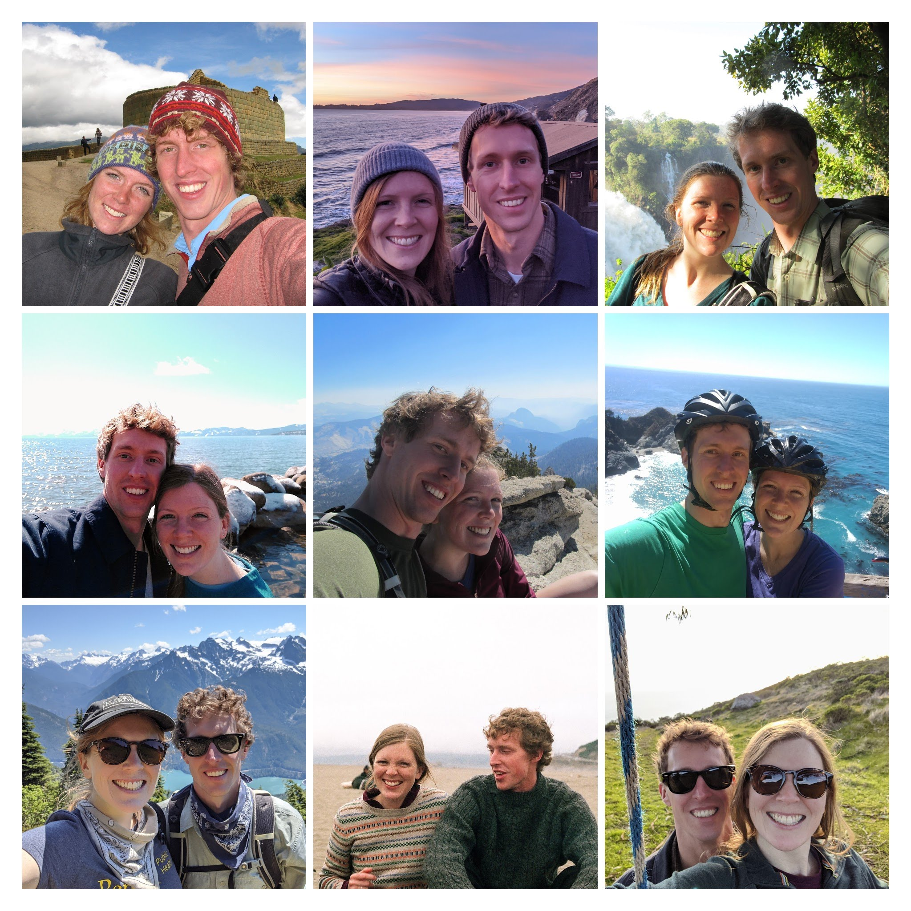

```{r echo=FALSE, warning=FALSE}
library(fontawesome)
```

  

<div align="center">

# August 19, 2023
### Michigan State University Horticulture Gardens
### East Lansing, Michigan 

</div>

********************************************************************************

Carrie and Tom met in high school and spent many afternoons running together—rain, snow, or shine—on MSU’s campus. We have since lived in Minnesota, Washington DC, Northern California, and Washington State, while remaining avid MSU basketball fans. We are excited to celebrate with friends and family in the place where our relationship started.

We have history in the MSU gardens. As a small child, Tom spent many afternoons catching frogs—and annoying garden staff—in the children’s garden pond. Carrie loved exploring the maze and secret garden nearby. Both of us have somewhat painful memories of running 1,000 meter repeats and taking senior prom photos here, as well.

No matter the location, we have always loved spending time together outdoors. The photo above is from a backpacking trip in North Cascades National Park, a day before Tom proposed and minutes before both were devoured by mosquitoes.

********************************************************************************
<div align="center">

## `r fa("calendar-alt")` 
# Events
<br/>

### Welcome bonfire  
#### **Friday, August 18**
#### [`r fa("clock", fill = "steelblue")`](https://calendar.google.com/calendar/u/0/r/eventedit?text=Welcome+bonfire&dates=20230818T233000Z/20230818T2600000Z&location=Lake+Lansing,+Michigan&details=Exact+location+to+be+provided){target="_blank"} 7:30-10:00 PM
#### [`r fa("map-marker-alt", fill = "steelblue")`](https://goo.gl/maps/DBe3k71e62ZftSYQ9){target="_blank"} Lake Lansing
###### (exact location to be provided)
<!-- ##### `r fa("sticky-note", fill = "grey")` Exact location to be provided -->
<!-- ##### `r fa("car", fill = "grey")` 13 minute drive/Uber/Lyft -->
<!-- ##### `r fa("tree", fill = "grey")` Outdoor event -->
<!-- ##### `r fa("tshirt", fill = "grey")` Casual attire -->
<br/>

### Campus run/walk 
#### **Saturday, August 19**
#### [`r fa("clock", fill = "steelblue")`](https://calendar.google.com/calendar/u/0/r/eventedit?text=Campus+run+or+walk&dates=20230819T123000Z/20230819T1330000Z&location=Graduate+East+Lansing){target="_blank"} 8:30 AM
#### [`r fa("map-marker-alt", fill = "steelblue")`](https://goo.gl/maps/zW3hXDTNX1tZMobx7){target="_blank"} Meet outside the Graduate Hotel
##### `r fa("running", fill = "grey")` Run/walk with us along the river
<!-- ##### `r fa("car", fill = "grey")` 13 minute drive/Uber/Lyft -->
<br/>

## Ceremony & Reception
#### **Saturday, August 19**
#### [`r fa("clock", fill = "steelblue")`](https://calendar.google.com/calendar/u/0/r/eventedit?text=Ceremony+and+Reception&dates=20230819T200000Z/20230819T2745000Z&location=MSU+Horticulture+Gardens){target="_blank"} 4:00-11:45 PM
#### [`r fa("map-marker-alt", fill = "steelblue")`](https://g.page/MSUHorticultureGardens?share){target="_blank"} MSU Horticulture Gardens
##### [`r fa("directions", fill = "steelblue")` Driving Directions (Parking Lot 53)](https://www.google.com/maps/dir//53,+East+Lansing,+MI+48823/@42.7209259,-84.476928,18z/data=!4m9!4m8!1m0!1m5!1m1!1s0x8822c288a5d5889f:0xa1077739acb0cdf6!2m2!1d-84.4758335!2d42.7209259!3e0){target="_blank"} 
##### `r fa("bus", fill = "grey")` Shuttle bus from the Graduate Hotel
##### `r fa("tree", fill = "grey")` Outdoor ceremony + reception under a large tent
##### `r fa("user-tie", fill = "grey")` Garden Party attire
<br/>

<div align="center">
### Farewell coffee
#### **Sunday, August 20**
#### [`r fa("clock", fill = "steelblue")`](https://calendar.google.com/calendar/u/0/r/eventedit?text=Farewell+coffee&dates=20230820T133000Z/20230820T1530000Z&location=East+Lansing,+Michigan&details=Exact+location+to+be+provided){target="_blank"} 9:30-11:30 AM
#### `r fa("map-marker-alt", fill = "grey")` Short walk from the Graduate Hotel
###### (exact location to be provided)
<!-- ##### `r fa("walking", fill = "grey")` 10 minute walk from the Graduate Hotel -->
<!-- ##### `r fa("tree", fill = "grey")` Indoor/outdoor event -->
<!-- ##### `r fa("tshirt", fill = "grey")` Casual attire -->
<br/>

</div>

********************************************************************************
<div align="center">

## `r fa("hotel")` 
# Accomodations
<br/>

### Graduate Hotel 
#### [`r fa("calendar-check", fill = "steelblue")` Reserve a Room](https://be.synxis.com/?adult=1&arrive=2023-08-18&chain=21643&child=0&config=sales&configcode=sales&currency=USD&depart=2023-08-20&group=9141982&hotel=10239&level=hotel&locale=en-US&rooms=1){target="_blank"} 
<div align="left">
The Graduate is centrally located in downtown East Lansing. Click the link above to book a room with our promotional rate (Group Code 9141982). **Parking:** *Please note that the Graduate only has valet parking (\$30/night). Additional parking lots and garages can be found [steps from the hotel](https://www.graduatehotels.com/east-lansing/wp-content/uploads/sites/28/2022/07/GRADUATE-EAST-LANSING_parking-2022.pdf){target="_blank"}, including the Albert Ave and Grove St garages for up to $20 per day and <span style="text-decoration:underline">free for Sunday departures</span>.*

<br/>


<!-- <div align="center"> -->
<!-- ### AirBnB -->
<!-- #### [`r fa("calendar-check", fill = "steelblue")` Reserve a Place](https://www.airbnb.com/s/East-Lansing--Michigan--United-States/homes?tab_id=home_tab&refinement_paths%5B%5D=%2Fhomes&flexible_trip_lengths%5B%5D=one_week&price_filter_input_type=0&price_filter_num_nights=2&channel=EXPLORE&query=East%20Lansing%2C%20MI&place_id=ChIJ86vl6nXoIogRJaZ8EfezGTs&date_picker_type=calendar&checkin=2023-08-18&checkout=2023-08-20&source=structured_search_input_header&search_type=user_map_move&room_types%5B%5D=Entire%20home%2Fapt&ne_lat=42.750968349440576&ne_lng=-84.46019841245987&sw_lat=42.70494198532223&sw_lng=-84.51985074095109&zoom=14&zoom_level=14&search_by_map=true) -->
<!-- <div align="left"> -->
<!-- See this [list](https://docs.google.com/document/d/1Y-vDQSb7EMFK9PtXjSGcKIvNdBro_2jcTB-cTvKjd9k/edit?usp=sharing){target="_blank"} we put together of a few available spots that have potential. We'll try to update this periodically. -->

<br/>

********************************************************************************
<div align="center">

## `r fa("plane")`
# Travel
<br/>

### Detroit Metro Airport (DTW)
#### [`r fa("calendar-check", fill = "steelblue")` Book Flights](https://www.google.com/travel/flights?q=Flights%20to%20DTW%20on%202023-08-18%20through%202023-08-20){target="_blank"}
<div align="left">
DTW is the largest nearby airport, where you will likely find the most flight options. It's about 1 hour and 20 minutes driving to/from East Lansing. We will help to coordinate carpooling when possible. Another option is the [Michigan Flyer](https://www.michiganflyer.com){target="_blank"} bus, which runs between DTW and downtown East Lansing ([see schedule](https://www.michiganflyer.com/Portals/0/pdf/MI%20Flyer%20Schedule%20Sept%2026,%202022.pdf?ver=2022-09-26-151944-360&timestamp=1664220051097){target="_blank"}).

<br/>


<div align="center">
### Lansing Airport (LAN)
#### [`r fa("calendar-check", fill = "steelblue")` Book Flights](https://www.google.com/travel/flights?q=Flights%20to%20LAN%20on%202023-08-18%20through%202023-08-20){target="_blank"}
<div align="left">
LAN is a small airport located just a 16 minute drive/Uber/Lyft from East Lansing. However, it typically has limited flight options.

<br/>


<div align="center">
### Grand Rapids Airport (GRR)
#### [`r fa("calendar-check", fill = "steelblue")` Book Flights](https://www.google.com/travel/flights?q=Flights%20to%20GRR%20on%202023-08-18%20through%202023-08-20){target="_blank"}
<div align="left">
GRR is also a relatively small airport, but sometimes has good flight options. It's a 1 hour drive from East Lansing.  We are not aware of any public transportation options, so you may need to rent a car if you fly here.

<br/>


********************************************************************************
<div align="center">
## `r fa("map-marked-alt")`
# Map
*Click on the icons below to open directions in Google Maps.*
<br/>

```{r echo=FALSE, warning=FALSE}
library(leaflet)

leaflet(width = "100%") %>%
  addTiles() %>% 
  setView(-84.442, 42.74, zoom = 12)%>% # Add default OpenStreetMap map tiles
  addAwesomeMarkers(lng=-84.48473719325384, lat=42.73572361857766, 
                    icon=awesomeIcons(
                      icon = 'fa-solid fa-bed',
                      library = 'fa',
                      markerColor = 'red'), 
                    popup="<b>Graduate Hotel</b><br><a href='https://goo.gl/maps/C8SfjMMr81KKGNyk9'>View in Google Maps</a>")   %>%
  addAwesomeMarkers(lng=-84.47424714951279, lat=42.721090115977475, 
                    icon=awesomeIcons( 
                      icon = 'fa-solid fa-heart',
                      library = 'fa',
                      # icon = 'ios-rose',
                      # library = 'ion',
                      iconColor = 'black',
                      markerColor = 'purple'), 
                    popup="<b>Ceremony & Reception</b><br>MSU Horticulture Gardens<br><a href='https://g.page/MSUHorticultureGardens?share'>View in Google Maps</a>") %>%   
  addAwesomeMarkers(lng=-84.47582572133092, lat=42.72094140759324,
                    icon=awesomeIcons(
                      icon = 'fa-solid fa-car',
                      library = 'fa',
                      markerColor = 'blue'),
                    popup="<b>Parking: Ceremony/Reception</b><br>Parking Lot 53<br><a href='https://goo.gl/maps/2EzqNMeHLGzoqkRg9'>View in Google Maps</a>") %>%
  addAwesomeMarkers(lng=-84.39902346348319, lat=42.7596629403435, 
                    icon=awesomeIcons(
                      icon = 'fa-solid fa-fire',
                      library = 'fa',
                      iconColor = 'black',
                      markerColor = 'orange'), 
                    popup="<b>Friday bonfire</b><br>Lake Lansing<br><a href='https://goo.gl/maps/DBe3k71e62ZftSYQ9'>View in Google Maps</a><br><i>Exact location to be provided</i>") %>%
  addAwesomeMarkers(lng=-84.48579584970942, lat=42.742237250823734, 
                    icon=awesomeIcons( 
                      icon = 'fa-solid fa-coffee',
                      library = 'fa',
                      # icon = 'ios-rose',
                      # library = 'ion',
                      iconColor = 'black',
                      markerColor = 'green'), 
                    popup="<b>Sunday coffee</b><br><i>Exact location to be provided</i>")


  
```

********************************************************************************
<div align="center">
## `r fa("info-circle")`
# Things to do
<br/>

<div align="left">

#### `r fa("walking")` [MSU Campus Walk](https://health4u.msu.edu/resources/msu-campus-walking-tour){target="_blank"}
<br/>

#### `r fa("leaf")` [Beal Botanical Garden](https://goo.gl/maps/6TFSAhXioqWKBVEM8){target="_blank"}
<br/>

#### `r fa("palette")` [Broad Art Museum](https://goo.gl/maps/LEGiTU6y2PZisvHd7){target="_blank"}
<br/>

#### `r fa("building")` [MSU Museum](https://goo.gl/maps/WbemnErzT8dpDbvA6){target="_blank"}
<br/>

#### `r fa("ice-cream")` [MSU Dairy Store](https://goo.gl/maps/1QgABaU1WsvhhWvN6){target="_blank"}
<br/>

#### `r fa("child")` [MSU Children's Garden](https://goo.gl/maps/cQ3BM7mZUjHMKCCM6){target="_blank"}
<br/>

#### `r fa("atom")` [Impression 5 Science Center](https://goo.gl/maps/tauue7REbCNd2Jza8){target="_blank"}
<!-- ###### `r fa("car-side")` 10 minute drive -->
<br/>

#### `r fa("hiking")` [Lake Lansing Park North](https://goo.gl/maps/n77FLWxFrMpCrniP7){target="_blank"}
<!-- ###### `r fa("car-side")` 15 minute drive -->
<br/>

#### `r fa("carrot")` [East Lansing Farmer's Market](https://www.cityofeastlansing.com/farmersmarket){target="_blank"}


<br/>

</div>


********************************************************************************
<div align="center">
## `r fa("gift")`
# Registry
<br/>

### [Zola.com](https://www.zola.com/registry/carrieandtom2023){target="_blank"}
<div align="left">
We have been fortunate to collect many household items during our years together. If you wish to help support our honeymoon, home improvement, pizza making, or donations to charity, please see our registry on Zola. Thank you!

</div>


<!-- ******************************************************************************** -->
<!-- <div align="center"> -->
<!-- ## `r fa("question-circle")` -->
<!-- # FAQs -->
<!-- <br/> -->

<!-- <div align="left"> -->
<!-- *Can kids attend the ceremony, reception, and other events?* -->

<!-- Yes! Your kids are welcome to attend all events. -->

<!-- <br/> -->

<!-- *What COVID precautions are you taking?* -->

<!-- All events will take place fully or partially outdoors. Our reception will be under a large tent at the MSU Gardens.  -->


<!-- We also ask that all guests test for Covid before attending any events, and please stay home if you test positive or feel unwell. -->


********************************************************************************

  


